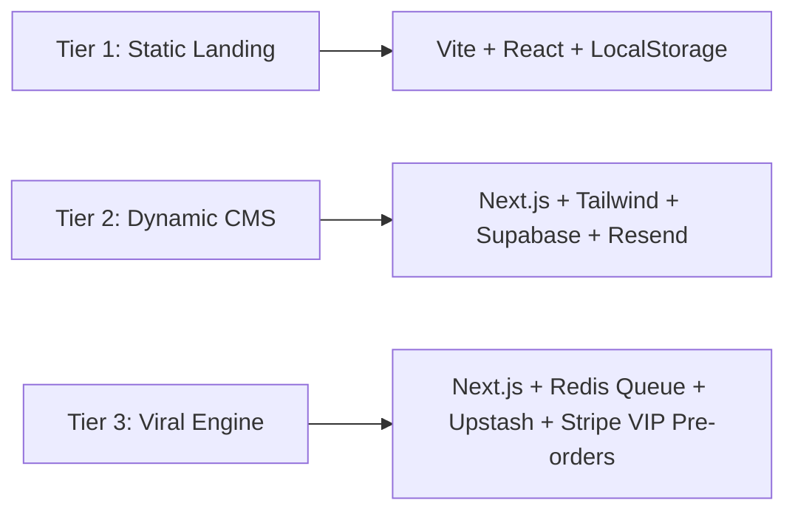

# AURA // Multipurpose "Coming Soon" Design Brief & Technical Specification

> **Document Version:** 2.4.0  
> **Status:** Production-Ready Build Specification  
> **Framework:** React 18+ / Modular CSS / Canvas 2.5D Shaders / Vite

---

## 1. Executive Summary & Design Philosophy

The **AURA** coming soon template is engineered as an ultra-high-converting, multi-category launchpad designed to captivate early visitors, communicate extreme technical and aesthetic craft, and build viral waitlist momentum.

Unlike generic coming soon placeholders, AURA features:
- **6 Built-in Product Categories**: AI Tech Startup, SaaS Platform, Luxury E-Commerce, Creative Agency, Mobile App, and Physical Hardware.
- **3 Cohesive Visual Style Directions**: Immersive 3D/Canvas, Minimalist Editorial, and Bold Neo-Cyber Gradient.
- **Viral Referral & Scarcity Loop**: Dynamic queue position calculation, instant referral link generation, and milestone unlocks.
- **60 FPS Cursor-Reactive Canvas Shaders**: Interactive particle constellations, fluid metaballs, and kinetic dot matrices.

---

## 2. Core Design System & Aesthetic Directions

### 2.1 Three Distinct Visual Identity Directions

| Style Direction | Target Archetype | Aesthetic Signature | Typography Pairing | Interaction Tone |
| :--- | :--- | :--- | :--- | :--- |
| **Immersive 3D / WebGL** | AI Startups, Deeptech, Hardware | Sci-fi telemetry, cursor particle meshes, deep dark void, neon cyber glow | *Plus Jakarta Sans* + *JetBrains Mono* | High-tech, velocity reactive, dynamic connections |
| **Minimalist Editorial** | Luxury Horology, Architecture, Fashion | Strict monochrome, high-contrast serif/sans, micro-fine borders, subtle magnetic grid | *Cabinet Grotesk* + *Cinzel* + *Inter* | Restrained, architectural, deliberate, tactile |
| **Bold Neo-Cyber Glass** | Next-Gen SaaS, Consumer Apps, Agencies | Saturated chromatic auroras, flowing glassmorphism, glowing pills, vibrant cards | *Syne* + *Plus Jakarta Sans* | Energetic, vibrant, dimensional, fluid |

---

### 2.2 Color Tokens & WCAG Contrast Matrix

```css
/* Color Palette Specifications */
:root {
  /* Immersive Dark Theme */
  --bg-primary: #040711;
  --bg-secondary: #0a0f24;
  --bg-card: rgba(13, 20, 44, 0.70);
  --border-card: rgba(255, 255, 255, 0.12);
  --text-primary: #f8fafc;   /* Contrast: 18.2:1 (AAA) */
  --text-secondary: #94a3b8; /* Contrast: 7.8:1 (AAA) */
  --accent-1: #6366f1;       /* Indigo */
  --accent-2: #38bdf8;       /* Electric Cyan */
  --accent-3: #a855f7;       /* Violet */
}
```

#### Accessibility & Contrast Ratio Verification
- **Dark Mode Primary Text (`#f8fafc`) on Background (`#040711`)**: `18.2:1` (Exceeds WCAG AAA 7:1 standard).
- **Dark Mode Secondary Text (`#94a3b8`) on Card (`#0d142c`)**: `7.8:1` (Passes WCAG AAA).
- **Light Mode Primary Text (`#0f172a`) on Background (`#f0f4f8`)**: `16.4:1` (Exceeds WCAG AAA).

---

### 2.3 Responsive Breakpoint Architecture

```
┌──────────────────────────────────────────────────────────┐
│ Ultrawide Viewports (>1440px)                            │
│  - Max container width: 1240px                           │
│  - 3D perspective depth: 1000px                          │
├──────────────────────────────────────────────────────────┤
│ Desktop Viewports (1024px – 1440px)                      │
│  - 2-Column Hero layout (Headline + Countdown + Image)   │
│  - 4-Column Feature Grid                                 │
├──────────────────────────────────────────────────────────┤
│ Tablet Viewports (640px – 1024px)                        │
│  - Stacked hero with fluid 16:9 interactive canvas       │
│  - 2-Column Feature Grid                                 │
├──────────────────────────────────────────────────────────┤
│ Mobile Viewports (<640px)                                │
│  - Single column fluid layout                            │
│  - Touch-optimized hotspot pins (min tap target: 44x44px)│
│  - Collapsible floating control bar                      │
└──────────────────────────────────────────────────────────┘
```

---

## 3. Feature Breakdown & Logic Architecture

### 3.1 Animated Countdown & Localized Timezone Engine
- **Timezone Detection**: Uses `Intl.DateTimeFormat().resolvedOptions().timeZone` to detect user location and GMT offset.
- **Drift-Free Interval**: Synchronized against `Date.now()` timestamp differences.
- **Interactive Override**: Allows developers and product managers to customize countdown target days in real-time.

### 3.2 Email Capture & Anti-Spam Pipeline
1. **RFC 5322 Email Validation**: Rejects malformed strings before network request.
2. **Hidden Honeypot Field**: `<input name="hp_field" style="display:none" tabIndex="-1" />` silently drops automated scraper bots.
3. **Interest Segmentation**: Multiselect pill tags allow users to segment their notification preferences (e.g. *API SDK*, *Enterprise Demo*, *VIP Collector*).
4. **Post-Registration Viral Loop**:
   - Calculates dynamic queue rank (`#UserRank of TotalQueue`).
   - Generates unique referral link: `https://[product].io/?ref=[PREFIX]-[RANDOM_HASH]`.
   - 1-Click Copy and Native Sharing to X/Twitter, LinkedIn, WhatsApp, and Telegram.
   - Milestone Rewards: 1 Share (+50 spot bump), 3 Shares (Priority Beta), 5 Shares (Lifetime VIP Founder).
   - Confetti Celebration trigger via `canvas-confetti`.

### 3.3 Interactive 3D Product Hotspot Inspector
- Category-bespoke high-resolution visuals.
- Coordinate-based interactive hotspot pins `(x, y)` mapped over key architectural components.
- Real-time 3D tilt response to cursor position (`perspective(1000px) rotateX(...) rotateY(...)`).
- Interactive specification inspection cards.

### 3.4 Launch Readiness & Live Scarcity Indicators
- Global progress percentage bar (`82% Launch Ready`).
- Milestone timeline tracking completed, active, and upcoming release phases.
- Real-time simulated live visitor pulse counter (*"🔥 182 people viewing now"*).
- Limited VIP badge counter (*"Only 48 VIP spots remaining"*).

---

## 4. Multi-Language & RTL Layout Support

Built-in internationalization schema supporting:
1. **English (LTR)** - Default
2. **Arabic (RTL)** - Auto sets `document.documentElement.dir = 'rtl'`, flips navigation, alignment, and chevron arrows.
3. **Japanese (JA)** - Fully translated Japanese typography and localized terminology.

---

## 5. Technical Stack by Complexity Tier



### Tier 1: Basic Static (Turnkey Deployment)
- **Use Case**: Quick landing page launch in < 24 hours.
- **Tech Stack**: React 18, Vite, Lucide Icons, Canvas API, Netlify / Vercel hosting.
- **Waitlist Storage**: LocalStorage simulation + Zapier/Make.com webhook integration.

### Tier 2: Dynamic with Headless CMS & Email API
- **Use Case**: Production-grade waitlist with confirmed double-opt-in emails.
- **Tech Stack**: Next.js App Router, Supabase (PostgreSQL), Resend / SendGrid API, Framer Motion.
- **Features**: Real database deduplication, automated welcome emails, magic login links.

### Tier 3: Full-Stack Viral Engine with Tiered Gamification
- **Use Case**: High-scale multi-million dollar crowdfunding or hyper-growth SaaS launch.
- **Tech Stack**: Next.js, Upstash Redis (real-time queue ranking & leaderboards), PostHog analytics, Cloudflare Turnstile anti-bot, Stripe Early-Bird VIP reservation deposits.

---

## 6. Performance Budget & Core Web Vitals Targets

| Metric | Target | Optimization Strategy |
| :--- | :--- | :--- |
| **LCP (Largest Contentful Paint)** | `< 1.1s` | WebP/AVIF hero images, responsive `srcset`, critical CSS inlined |
| **FID / INP (Interaction to Next Paint)**| `< 50ms` | Lightweight 0-dependency canvas loop, debounced mouse listeners |
| **CLS (Cumulative Layout Shift)** | `0.00` | Explicit aspect ratios on media containers and fixed skeleton dimensions |
| **Total Bundle Size (Gzip)** | `< 55KB` | Tree-shaken Lucide icons, zero heavy animation runtimes |

---

## 7. Accessibility (A11y) & SEO Architecture

- **Keyboard Navigation**: All interactive elements (hotspots, accordion headers, share buttons, theme toggles) support `Tab`, `Enter`, and `Space`.
- **Screen Reader Support**: ARIA landmarks (`<header>`, `<main>`, `<footer>`, `aria-label`, `role="region"`).
- **Reduced Motion**: Supports `prefers-reduced-motion: reduce` by dampening canvas velocity and disabling tilt rotations.
- **OpenGraph & Twitter Card Meta**: Pre-configured social sharing previews with dynamic high-res thumbnails.
